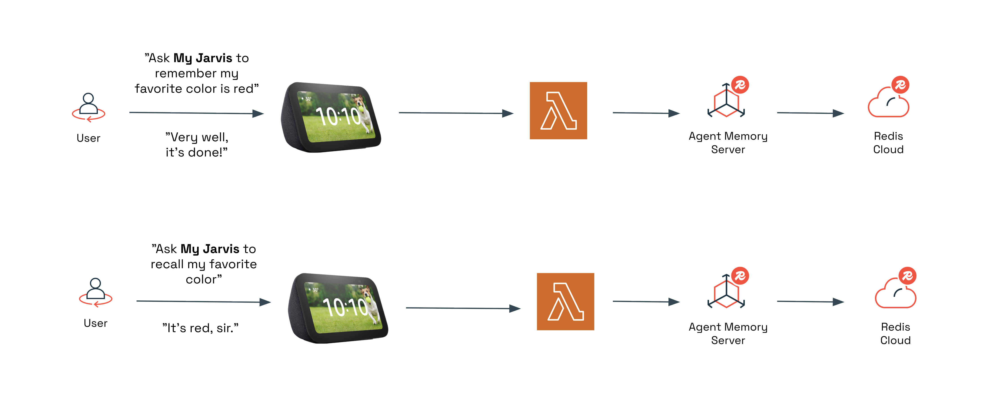
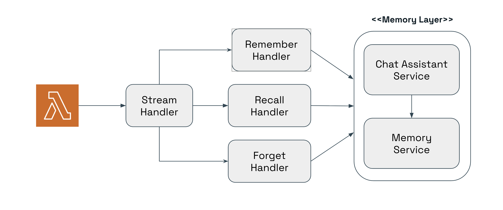
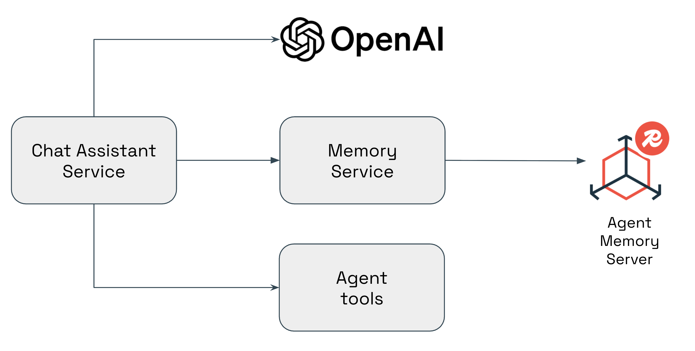

# Agent Memory Server with Alexa Demo

## Overview
This demo demonstrates how [Redis Agent Memory Server](https://redis.github.io/agent-memory-server) can extend Amazon Alexa with conversational memory. Built using Java, LangChain4J, AWS Lambda, and Redis Cloud, it enables Alexa to recall past conversations and deliver contextual, intelligent responses. It showcases how Redis can act as a memory layer for AI assistants, enriching the natural language experience through state persistence and fast retrieval.

## Table of Contents
- [Demo Objectives](#demo-objectives)
- [Setup](#setup)
- [Running the Demo](#running-the-demo)
- [Slide Deck](#slide-deck)
- [Architecture](#architecture)
- [Known Issues](#known-issues)
- [Resources](#resources)
- [Maintainers](#maintainers)
- [License](#license)

## Demo Objectives
- Demonstrate Redis as a memory persistence layer for conversational AI.
- Show how to integrate Redis Agent Memory Server via REST API calls.
- Automate Alexa skill deployment using Terraform, AWS Lambda, and the ASK CLI.
- Illustrate how Redis Cloud can support scalable AI use cases.
- Demonstrate how to implement context engineering with LangChain4J.

## Setup

### Dependencies
- [Java 21+](https://www.oracle.com/java/technologies/downloads)
- [Maven 3.9+](https://maven.apache.org/install.html)
- [Terraform](https://developer.hashicorp.com/terraform/install)
- [AWS CLI](https://github.com/aws/aws-cli)
- [ASK CLI](https://github.com/alexa/ask-cli)
- [JQ](https://jqlang.org/)
- [SED](https://formulae.brew.sh/formula/gnu-sed)

### Account Requirements
| Account | Description |
|:--|:--|
| [AWS account](https://aws.amazon.com/account) | Required to create Lambda, IAM, EC2, and CloudWatch resources. |
| [Amazon developer account](https://developer.amazon.com) | Needed to register and deploy Alexa skills. |
| [Redis Cloud](https://redis.io/try-free) | Hosts the Redis database used by the Redis Agent Memory Server. |

### Configuration

#### AWS Setup
1. Install the AWS CLI: [Installation Guide](https://docs.aws.amazon.com/cli/latest/userguide/getting-started-install.html)
2. Configure your credentials:
   ```sh
   aws configure
   ```

#### Amazon Developer Account
1. Install the ASK CLI: [Installation Guide](https://developer.amazon.com/en-US/docs/alexa/smapi/quick-start-alexa-skills-kit-command-line-interface.html)
2. Configure your credentials:
   ```sh
   ask configure
   ```

#### Redis Cloud
1. [Enable your APIs from Redis Cloud](https://redis.io/docs/latest/operate/rc/api/get-started/enable-the-api/).
2. Export them as environment variables:
   ```sh
   export REDISCLOUD_ACCESS_KEY=<YOUR_API_ACCOUNT_KEY>
   export REDISCLOUD_SECRET_KEY=<YOUR_API_USER_KEY>
   ```

#### Terraform Configuration
1. Create your variables file:
   ```sh
   cp infrastructure/terraform/terraform.tfvars.example infrastructure/terraform/terraform.tfvars
   ```
2. Edit `infrastructure/terraform/terraform.tfvars` with your information:

| Variable                         | Description                                                                                                                                                                                                                                                                                                                                                                                                         |
|:---------------------------------|:--------------------------------------------------------------------------------------------------------------------------------------------------------------------------------------------------------------------------------------------------------------------------------------------------------------------------------------------------------------------------------------------------------------------|
| `application_prefix`             | Prefix used for the Redis Cloud subscription's name and the database name.                                                                                                                                                                                                                                                                                                                                          |
| `database_predefined`            | Set to `true` if you want to disable the automatic creation of the database, so you can manually create it at Redis Cloud. Note that if you do this, you must create the database using some naming conventions. The subscription name must follow the pattern `${var.application_prefix}-${var.subscription_name}` and the database name must follow the pattern `${var.application_prefix}-${var.database_name}`. |
| `payment_card_type`              | Credit card type linked to Redis Cloud (e.g., “Visa”). Use it only if the variable `database_predefined` is `false`.                                                                                                                                                                                                                                                                                                |
| `payment_card_last_four`         | Last four digits of your card (e.g., “1234”). Use it only if the variable `database_predefined` is `false`.                                                                                                                                                                                                                                                                                                                                                                      |
| `essentials_plan_cloud_provider` | Cloud provider for Redis Cloud (e.g., “AWS”). Use it only if the variable `database_predefined` is `false`.                                                                                                                                                                                                                                                                                                                                                                      |
| `essentials_plan_cloud_region`   | Region for hosting Redis (e.g., “us-east-1”). Use it only if the variable `database_predefined` is `false`.                                                                                                                                                                                                                                                                                                                                                                      |
| `openai_api_key`                 | API key used by the Alexa skill and Agent Memory Server.                                                                                                                                                                                                                                                                                                                                                            |

#### Installation & Deployment
Once configured, deploy everything using:
```sh
./deploy.sh
```

When the deployment completes, note the output values including the Lambda ARN, Redis Agent Memory Server endpoint, and SSH command for validation.

You can verify if the Agent Memory Server is operational by saying:

> “Alexa, ask my jarvis to check the memory server.”

## Running the Demo

Once the deployment is complete, you can interact with your Alexa skill named **my jarvis**.



### 🗣️ Examples of interactions
- "Alexa, tell my javis to remember that my favorite programming language is Java."
- "Alexa, ask my jarvis to recall if Java is my favorite programming language."
- "Alexa, tell my jarvis to remember I have a doctor appointment next Monday at 10 AM."
- "Alexa, ask my jarvis to suggest what should I do for my birthday party."

### Teardown
To remove all deployed resources:
```sh
./undeploy.sh
```

## Slide Deck
📑 [Agent Memory Server with Alexa Presentation](./slides/agent-memory-server-with-alexa-demo.pdf)    
Covers demo goals, motivations for a memory layer, and architecture overview.

## Architecture

This architecture uses an Alexa skill written in Java and hosted as an AWS Lambda function. At the code of the Lambda function, it implements a stream handler that processes user requests and responses using the Agent Memory Server as memory storage.


As part of the stream handler implementation, it uses a Chat Assistant Service that leverages LangChain4J to manage interactions with the Agent Memory Server. This service implements context engineering, ensuring that conversations are enriched with relevant historical data stored in Redis. OpenAI is the LLM used to process and generate responses.

## Known Issues
- Initial Agent Memory Server boot-up may take several minutes before becoming reachable.
- Alexa Developer Console may require manual linking if credentials are not fully synchronized.

## Resources
- [Redis Agent Memory Server](https://redis.github.io/agent-memory-server)
- [Redis Cloud](https://redis.io/try-free)
- [AWS Lambda Documentation](https://docs.aws.amazon.com/lambda)
- [Amazon Alexa Skills Kit](https://developer.amazon.com/en-US/alexa/alexa-skills-kit)

## Maintainers
**Maintainers:**
- Ricardo Ferreira — [@riferrei](https://github.com/riferrei)

## License
This project is licensed under the [MIT License](./LICENSE).
